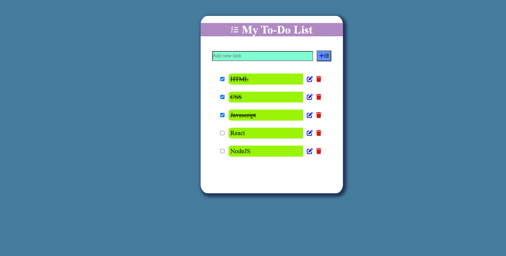

# 📝 React To-Do List App

A responsive and interactive **To-Do List** application built with **React**, allowing users to:

- ✅ Add new tasks
- 📝 Edit existing tasks
- ❌ Delete tasks
- ✔️ Mark tasks as completed

---

## 📁 Project Structure
src/
└── component/
├── Header.jsx # Top header of the app
├── TodoList.jsx # Main logic for adding, editing, deleting todos
└── TodoItem.jsx # Individual todo item component

---

## 🛠️ Tech Stack

- React (Vite)
- JavaScript (ES6+)
- HTML & CSS

---

## 🚀 Getting Started

### 1. Clone the Repository

#  bash
git clone https://github.com/Arti2510/React-Assignment1Git.git
cd React-Assignment1Git

............

##  Install Dependencies

Make sure you have Node.js installed.
npm install
npm run dev

🙋‍♀️ Author
GitHub: @Arti2510

📸 Project Screenshot

# React + Vite

This template provides a minimal setup to get React working in Vite with HMR and some ESLint rules.

Currently, two official plugins are available:

- [@vitejs/plugin-react](https://github.com/vitejs/vite-plugin-react/blob/main/packages/plugin-react) uses [Babel](https://babeljs.io/) for Fast Refresh
- [@vitejs/plugin-react-swc](https://github.com/vitejs/vite-plugin-react/blob/main/packages/plugin-react-swc) uses [SWC](https://swc.rs/) for Fast Refresh

## Expanding the ESLint configuration

If you are developing a production application, we recommend using TypeScript with type-aware lint rules enabled. Check out the [TS template](https://github.com/vitejs/vite/tree/main/packages/create-vite/template-react-ts) for information on how to integrate TypeScript and [`typescript-eslint`](https://typescript-eslint.io) in your project.
